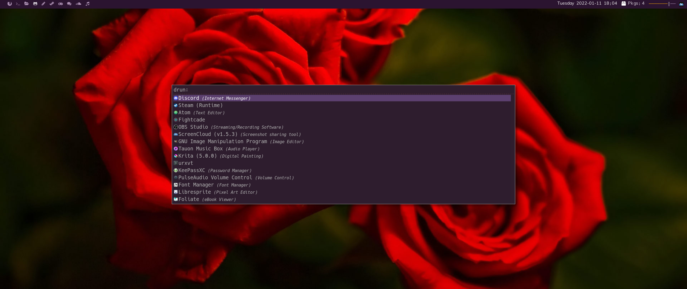
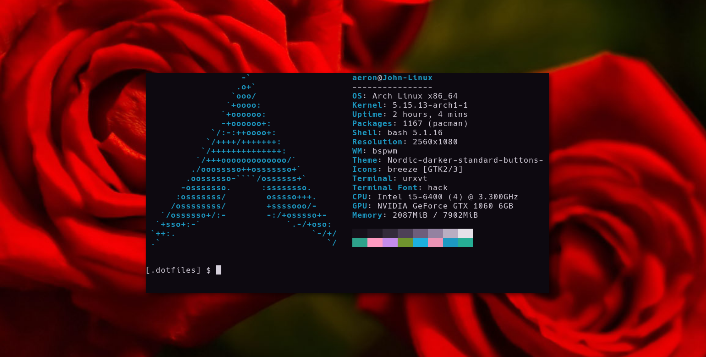

Personal dotfiles for my Arch-Linux bspwm setup 😎

[ UNDER CONSTRUCTION]

<b>Dependencies</b>

Don't forget to enable multilib on your pacman.conf

Pacman: 
```
sudo pacman -S --needed -<~/.dotfiles/packages.txt
```

yay: 
```
yay -S $(cat ~/.dotfiles/packages_aur.txt |xargs) --needed
```


</p>
Image below for preview



